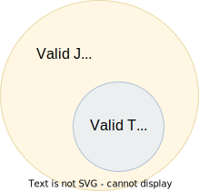

### TypeScript—a Language or a Linter?

TypeScript started out as a compiled programming language similar to JavaScript, but with types, classes, and other exotic features that were left out from an aging JavaScript (ECMAScript) standard. But as new standards were released and implemented by the browsers, most of the features that TypeScript initially brought to the ecosystem were added to the JavaScript language itself. TypeScript today is no longer widely used to compile JavaScript code—this task is left to the bundlers—but its sole purpose is to serve as a _linter_ which analyzes the code for imperfections before the compiled code ever runs.

When you write TypeScript code such as this:

```typescript
const pi = 3.14159
console.log('tau', 2 * pi)
```

TypeScript verifies that the operations on all values can be performed without runtime errors. The example above will pass the type checker, because TypeScript recognizes that both `pi` and `2` are numbers, which can be multiplied.

If you instead would have written:

```typescript
const pi = '3.14159'
console.log('tau', 2 * pi)
```

TypeScript would have generated a _type error_ in the IDE, because multiplying a string with a number would have generateda runtime error.

Note that the code above does not contain any TypeScript-specific syntax, yet TypeScript was able to analyze and catch the error regardless. TypeScript also bring its own syntax to the game, such as type annotations:

```typescript
const pi: number = 3.14159
console.log('tau', 2 * pi)
```

This code cannot run in the browser, because the type annotations are not valid JavaScript. When you compile TypeScript code into JavaScript code, the types are simply eliminated from the output. The code above would be compiled into:

```typescript
const pi = 3.14159
console.log('tau', 2 * pi)
```

The type checking is a separate process from the compilation, hence why TypeScript nowadays is regularly used as a linter, but seldom as a compiler.

In this sense, we can understand TypeScript more as a powerful linter, rather than an entirely different programming language.

Excluding the type annotations (and a couple of TypeScript-specific features), all valid TypeScript programs are valid JavaScript programs. But not all valid JavaScript programs are able to pass TypeScript's type checker. While you might have heard otherwise, in this sense, TypeScript is a _subset_ of JavaScriptWith—not the other way around:

.All programs that pass the type checker are valid JavaScript programs, but not all valid JavaScript programs pass the type checker; hence TypeScript is a subset of JavaScript.



NOTE: Because TypeScript adds new syntax and features to the language, from a certain point of view, TypeScript can be considered a superset of JavaScript: while most JavaScript programs cannot pass the type checker, all be compiled by TypeScript; but not all TypeScript programs can be run as JavaScript. Though, since TypeScript is seldom used as a compiler nowadays, this point of view is less relevant.
