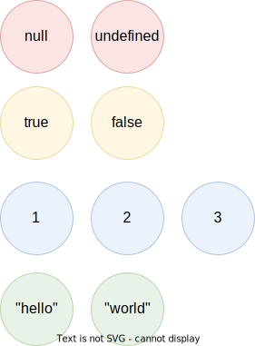

# Literal Types

If `never` is the simplest type because it doesn't contain any values, the second-simplest category of types is the types that contain a single value: these types are called _type literals_:

```typescript
const nothing: undefined = undefined
```

This just tells us that `nothing` can only ever have one value: `undefined`. Note that the occurrence of `undefined` between the `:` and `=` symbols is actually a type and not a value. For each literal value, there exists a corresponding type with the same name.

> For each literal value, there exists a corresponding type with the same name.

So the values `undefined`, `true`, `false`, `123`, and `"hello"` can be either values or types depending on where in the syntax tree they appear. For example, if a literal appears directly after an assigment operator (`=`), it is a value; but if it appears after the colons (`:`) after a variable declaration, it is a type.


