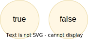
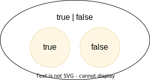

# Union Types

Value types are not very interesting on their own--they get much more interesting when they're combined into larger types. Consider the two types `true` and `false`:



TypeScript has _type operators_ that let you combine types in various ways. One of these operators is the _type union operator_ `|`, which lets you combine two types into a new type that contains all values from both operands. Since types correspond to sets, the union operator `|` corresponds to the set union operator stem:[\uu]:



In TypeScript, this can be written as such:

```typescript
const amIHappy: true | false = true
```

The expression `true | false` can be read as "true or false". Since it's a type operator, it only evaluated at compile-time by the type checker.

`true | false` is such a common occurrence that TypeScript has a built-in type for it; called `boolean`:

```typescript
const amIHappy: boolean = true
```

NOTE: `boolean` is a primitive type. All primitive types are always written in lowercase.
