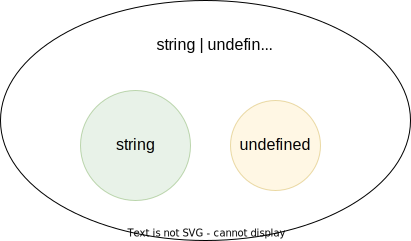

# Type Guards

Consider a type that is a union between two smaller types; for example `number | undefined`:



If you want to use the value as a number, you first need to check that it' not `undefined` before you can use it. This is called a _type guard_.

```typescript
const value: number | undefined = ...
if(value !== undefined) {
  console.log('Twice', value * 2)
}
```

TypeScript understands that if the conditional statement gets executed, `value` cannot be `undefined`, and can therefore be used as a number: TypeScript has _narrowed down_ the type from `number | undefined` to `number`.
