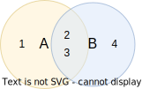
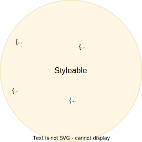
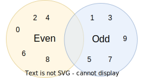

# Intersection types (`&`)


We have frequently made use of the union type operator `|`, which corresponds to the set union operator stem:[\uu]. The intersection type operator `&` corresponds to the set intersection operator stem:[\nn], and returns the type where all values in the set exists in both type operands:

```typescript
type A = 1 | 2 | 3
type B = 2 | 3 | 4
// Result: `2 | 3`
type C = A & B
```

.The result of the intersection is a type that contain the values that exists in both sets; in this example `2 | 3`.



There are two interesting special cases to consider--intersections with `never` and `unknown`:

- Since `never` represents an empty set, an intersection with `never` always results in `never`--there simply are no values that are both in a given type `T` _and_ the empty set `never`; for example;
+
```typescript
type A = 1 | 2 | 3
type B = never
// Result: `never`
type C = A & B
```
- Since `unknown` represents the set of all values, an intersection between a given type `T` and `unknown` always results in `T`--all values in `T` are also in `unknown`; for example;
+
```typescript
type A = 1 | 2 | 3
type B = unknown
// Result: `1 | 2 | 3`
type C = A & B
```

Intersections are most useful when dealing with objects. As an example, consider the following type:

```typescript
type Styleable = {
  color: string
  backgroundColor: string
}
```

It consists of _all_ objects where the `color` and `background` properties are `string`:



Note that this type does not forbid extra properties--the only requirement is that the `color` and `backgroundColor` properties have the type `string`, but it does not impose restrictions on other properties.

Now, consider a second type:

```typescript
type Clickable = {
  onClick: () => void
}
```

This type consists of all objects where the `onClick` property is a function that returns `void`. As with `Styleable`, it does not impose limitations on other properties:



When we take the intersection of `Styleable` and `Clickable`, we get the type of all objects that have `color`, `backgroundColor`, and `onClick` properties:

```typescript
// Result: { color: string, backgroundColor: strong, onClick: () => void }
type Button = Styleable & Clickable
```



But be mindful of using intersections on types that do not overlap. Let's start with a simple example:

```typescript
type EvenDigit = 0 | 2 | 4 | 6 | 8
type OddDigit = 1 | 3 | 5 | 7 | 9
// Result: `never`
type OddAndEvenDigit = Even & Odd
```

Which digits are both even and odd? Obviously, such number does not exist, so the set of both even and odd number is empty, which means that the type is `never`



When performing intersections on object types, you're likely to at some point encounter scenarios where some properties resolve to `never`. Consider this intersection:

```typescript
type Button = {
     // Expects a string like '5px', or `50%`
    borderRadius: string
    onClick: () => void
}
type Box = {
    // Expects a number in pixels
    borderRadius: number
    padding: number
}
type BoxButton = Button & Box
```

This is equivalent evaluate to an object where each property value is an intersection:

```typescript
// Button & Box
type BoxButton = {
    // One of the operands are `unknown` because at least one of the types do not impose a constraint on the property
    // Result: () => void
    onClick: (() => void) & unknown
    // Result: number
    padding: unknown & number
    // Both operands impose constraint on `borderRadius`
    // Result: never
    borderRadius: string & number
}
```

Which values are both `number` and `string`? The answer is none, and thus the type corresponds to the empty set, which is represented by `never`.

```typescript
// Result
type BoxButton = {
    onClick: () => void
    padding: number
    borderRadius: never
}
```

In earlier chapters, we learned that it's not possible to construct a value from `never`, since there are no values to choose from:

```typescript
// Error: there's no value in `never` to assign to `a`.
const a: never
```

This implies that when a property is of type `never` we can't construct the object as a whole:

```typescript
// Error: the property `borderRadius` is missing, but we can't add it because there's no value in `never` to assign to it.
const boxButton: BoxButton = {
    onClick: () => undefined,
    padding: 10,
}
```

This means that the set of all values in `BoxButton` is empty, which means that `BoxButton` is effectively `never`.

